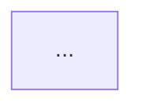

# Skill: Arquitectura Técnica (Backend + Frontend)

Genera el documento de arquitectura del proyecto a partir del PRD y las historias de usuario existentes, y lo persiste en `docs/architecture/architecture.md`.

## Cuándo usar esta skill

Cuando ya existe un PRD (y preferiblemente HUs) y se necesita definir cómo se va a construir el sistema antes de empezar a implementar: componentes, modelo de datos, flujos críticos y estructura de carpetas de backend y frontend.

---

## Protocolo de ejecución

Esta skill se ejecuta **siempre** delegando a una sesión del subagente `software-architect` vía la herramienta `Agent`. Nunca diseñes la arquitectura vos mismo — el subagente es el único responsable del diseño técnico.

```
Agent({
  subagent_type: "software-architect",
  prompt: "<contexto del proyecto + PRD + HUs + instrucciones de esta skill>"
})
```

Pasale al agente:
1. El contenido del PRD encontrado en `docs/PRD-*.md`
2. El contenido de las HUs en `docs/user-stories/` (si existen)
3. El contenido de `CLAUDE.md` (si existe)
4. El contenido actual de `docs/architecture/architecture.md` (si ya existe)
5. Las instrucciones completas de las fases 1, 2, 3 y 4 de esta skill

El stack es fijo y no se negocia: **backend en FastAPI, frontend en React**, con **arquitectura hexagonal** en el backend y **slicing por dominio/feature** en ambas capas.

---

### Fase 1 — Leer contexto existente

- Buscá el PRD en `docs/PRD-*.md`. Si no existe, detenete y decile al usuario que corra primero `/1-project-discovery`.
- Buscá HUs en `docs/user-stories/*.md`. Si existen, usalas para identificar flujos concretos y entidades — enriquecen los diagramas de secuencia y el modelo de datos. Si no existen, trabajá solo con el PRD.
- Si ya existe `docs/architecture/architecture.md`, no lo sobrescribas sin avisar: preguntale al usuario si querés **regenerar desde cero** o **actualizar** el documento existente con lo que cambió en el PRD/HUs.

---

### Fase 2 — Aclaraciones (solo si hace falta)

El PRD y las HUs deberían cubrir casi todo lo necesario para diseñar la arquitectura. No conviertas esto en una entrevista larga.

Preguntá **como mucho una pregunta por turno**, y solo si es bloqueante para el diseño (por ejemplo: no se puede inferir con confianza cuáles son los dominios/bounded contexts principales). Para todo lo demás, hacé el supuesto más razonable y dejalo explícito en el documento en vez de preguntar — por ejemplo, tipo de base de datos, si el frontend es SPA o PWA, etc.

---

### Fase 3 — Diseñar la arquitectura

El subagente `software-architect` debe producir los siguientes artefactos, todos en Mermaid donde aplique:

**1. Diagrama de sistemas** (`graph TD` o `graph LR`)
Componentes principales: actores/roles del PRD, frontend React, backend FastAPI, base de datos, servicios externos identificados en el PRD (identidad, riesgo/seguro, pagos, etc.), y el protocolo de comunicación entre ellos (REST/HTTPS, webhooks si aplica). Acompañar con una breve descripción de cada componente.

**2. Diagrama de base de datos** (`erDiagram`)
Entidades principales inferidas del PRD/HUs, con atributos, tipos, claves primarias y foráneas, relaciones y cardinalidad. No inventar entidades que no estén respaldadas por el PRD o las HUs.

**3. Diagramas de secuencia** (`sequenceDiagram`)
Uno por cada flujo crítico del MVP (según las funcionalidades clave del PRD). Mostrar la interacción entre actor, frontend, backend (caso de uso), servicios externos y base de datos.

**4. Estructura de carpetas — Backend (FastAPI)**
Patrón: **arquitectura hexagonal + slicing por dominio**. Cada dominio identificado en el PRD es una carpeta con sus propias subcapas (`domain/`, `application/`, `infrastructure/` con adaptadores de entrada y salida separados), más un módulo compartido (`shared/`) y el entrypoint de FastAPI. Mostrar el árbol usando los dominios reales del proyecto, no genéricos.

**5. Estructura de carpetas — Frontend (React)**
Patrón: **slicing por feature**, con capas equivalentes dentro de cada feature (`ui/`, `model/`, `api/`), más una capa compartida (`shared/`) y la capa de aplicación (`app/` con rutas y providers). Mostrar el árbol usando los dominios reales del proyecto.

**6. Decisiones clave, riesgos y supuestos**
Usando el mismo formato que el subagente ya usa por defecto (Objetivo, Contexto, Dominios, Interfaces, Adaptadores, Decisiones clave, Riesgos, Supuestos, Orden sugerido), aplicado a nivel de documento completo.

---

### Fase 4 — Persistir en disco

- Creá la carpeta `docs/architecture/` si no existe.
- Guardá todo en `docs/architecture/architecture.md` siguiendo esta plantilla:

```markdown
# Arquitectura — [Nombre del proyecto]

## 1. Diagrama de sistemas



[Descripción breve de componentes y comunicación]

## 2. Diagrama de base de datos

```mermaid
erDiagram
...
```

[Descripción breve de entidades principales]

## 3. Diagramas de secuencia

### [Nombre del flujo 1]

```mermaid
sequenceDiagram
...
```

[Repetir por cada flujo crítico del MVP]

## 4. Estructura de carpetas — Backend (FastAPI)

Patrón: arquitectura hexagonal + slicing por dominio.

```
backend/
  src/
    [dominio_1]/
      domain/
      application/
      infrastructure/
        api/            # adaptador de entrada (routers FastAPI)
        persistence/    # adaptador de salida (repositorios)
        external/       # adaptador de salida (APIs externas)
    [dominio_2]/
      ...
    shared/
      domain/
      infrastructure/
    main.py
```

## 5. Estructura de carpetas — Frontend (React)

Patrón: slicing por feature.

```
frontend/
  src/
    features/
      [dominio_1]/
        ui/
        model/
        api/
      [dominio_2]/
        ...
    shared/
      ui/
      lib/
    app/
      routes/
      providers/
```

## 6. Decisiones clave

| Decisión | Justificación |
|----------|----------------|
| ... | ... |

## 7. Riesgos

- [Qué puede salir mal y su impacto]

## 8. Supuestos

- [Lo que se asume sin confirmación]

## 9. Próximos pasos sugeridos

- [Qué sigue: tickets técnicos, setup de repos, etc.]
```

- Al finalizar, mostrá un resumen: dominios identificados, diagramas incluidos, y las decisiones/supuestos más relevantes.

---

## Reglas de conducta

- Delegá siempre el diseño al subagente `software-architect` — no lo hagas vos mismo en el hilo principal.
- No inventes dominios ni entidades que no estén respaldados por el PRD o las HUs.
- El stack es fijo: FastAPI (backend) y React (frontend). No propongas alternativas salvo que el usuario lo pida explícitamente.
- Respetá la arquitectura hexagonal y el slicing por dominio como patrón por defecto en ambas capas.
- Si ya existe `docs/architecture/architecture.md`, no lo sobrescribas sin confirmación del usuario.
- Dejá explícitos los supuestos y decisiones cuando el PRD/HUs no cubran el detalle necesario.
- Hablá en español.
