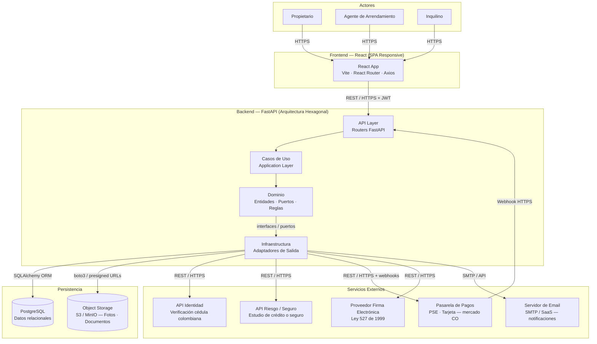
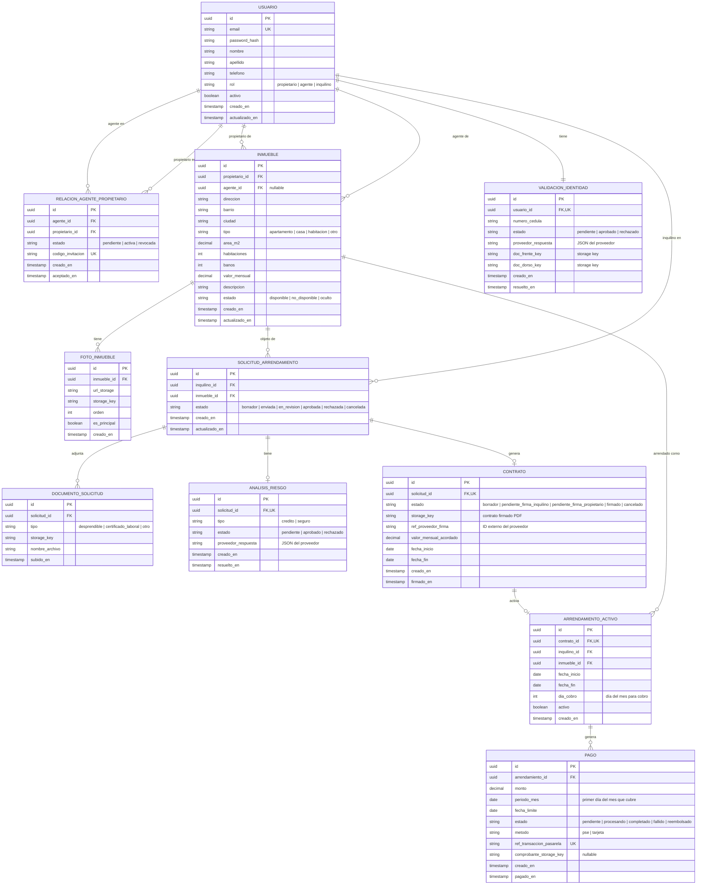
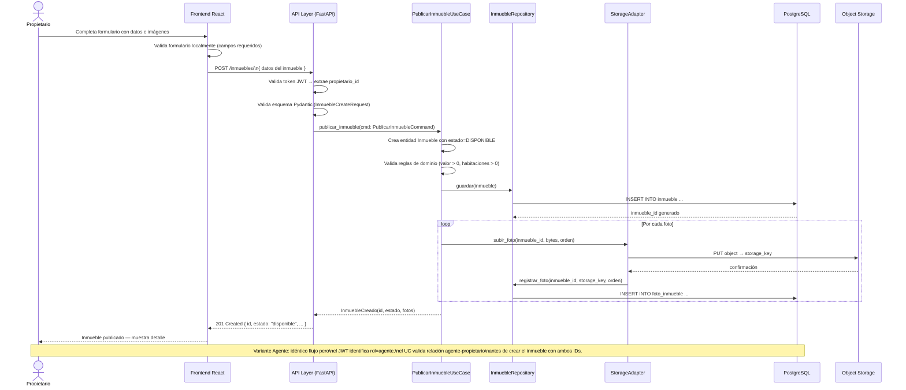
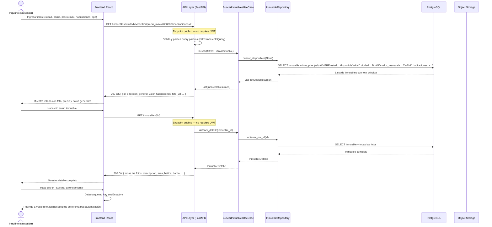
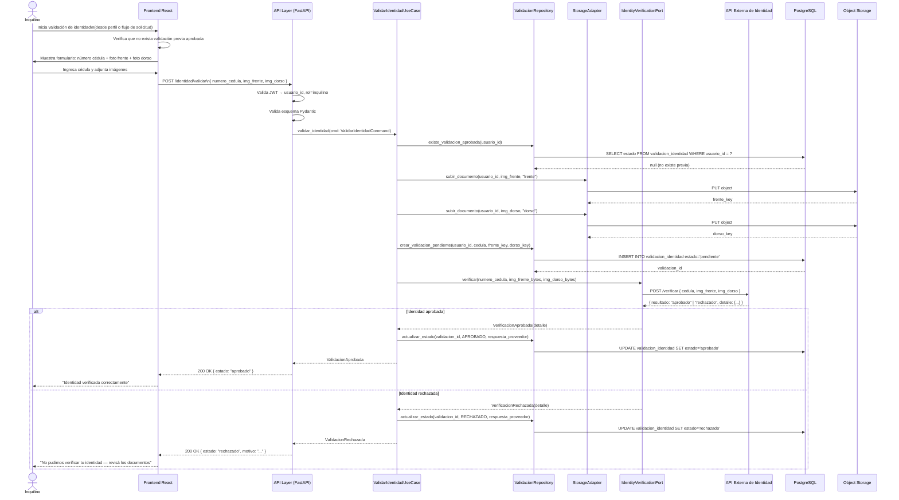
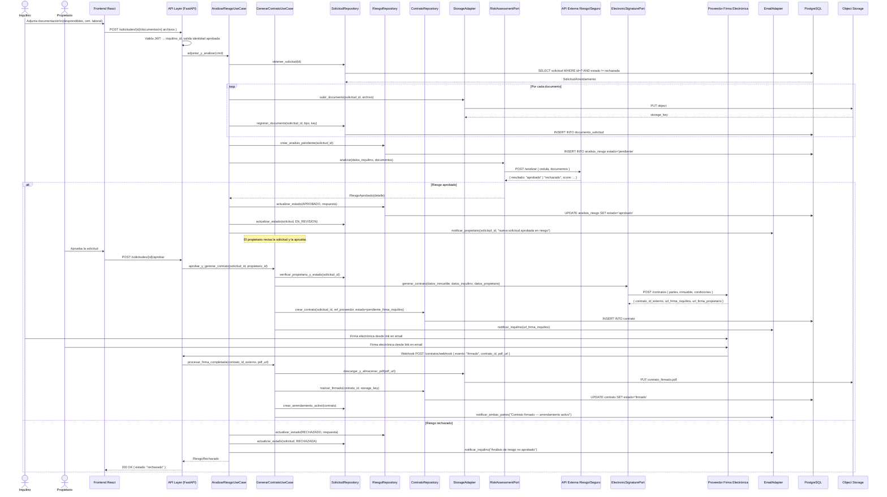
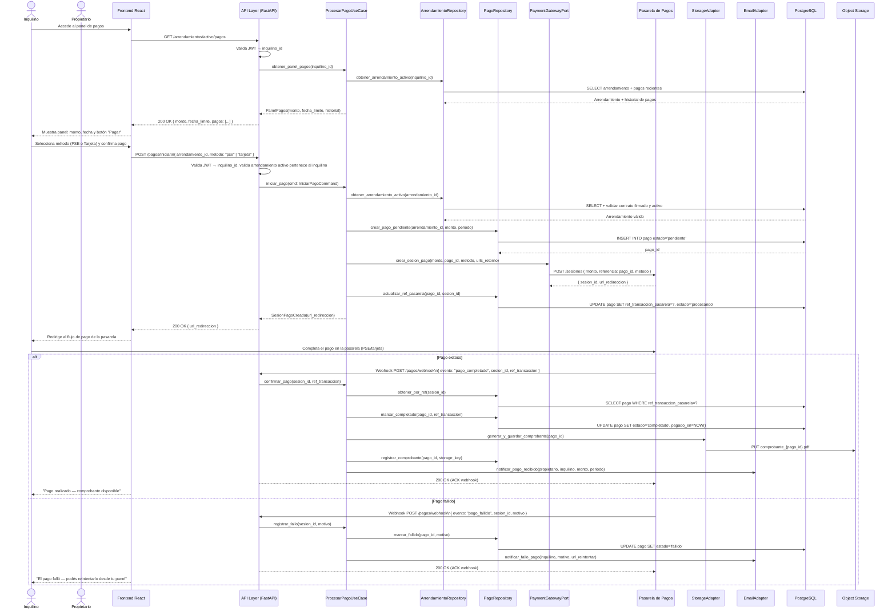

# Arquitectura — Plataforma de Arrendamiento Residencial de Larga Estadía

---

## 1. Diagrama de sistemas



**Descripción de componentes:**

| Componente | Responsabilidad |
|---|---|
| React App | SPA responsiva que consume la API REST del backend. Slicing por feature/dominio. Maneja estado local y caché de peticiones con React Query. |
| API Layer (FastAPI) | Adaptadores de entrada HTTP. Validan esquemas Pydantic, extraen JWT, delegan al caso de uso correspondiente. No contienen lógica de negocio. |
| Application Layer | Casos de uso que orquestan el dominio. Coordinan puertos de salida sin depender de implementaciones concretas. |
| Dominio | Entidades, objetos de valor, agregados y puertos (interfaces). Contiene las reglas de negocio puras. Sin dependencia de frameworks. |
| Infraestructura | Adaptadores de salida: repositorios SQLAlchemy, clientes HTTP para APIs externas, cliente S3, cliente email. Implementan los puertos del dominio. |
| PostgreSQL | Base de datos relacional principal para todos los datos transaccionales y de estado. |
| Object Storage (S3/MinIO) | Almacenamiento de fotos de inmuebles y documentos del inquilino (cédula, desprendibles, contratos firmados). |
| API Identidad | Servicio externo colombiano para verificación de cédula de ciudadanía con imagen del documento. |
| API Riesgo / Seguro | Servicio externo para estudio de crédito o contratación de seguro de arrendamiento. Adaptador intercambiable. |
| Pasarela de Pagos | Procesador de pagos con soporte PSE y tarjeta crédito/débito en Colombia. Notifica via webhooks. |
| Proveedor Firma Electrónica | Servicio con validez legal bajo Ley 527 de 1999. Genera y almacena contratos firmados digitalmente. |
| Servidor de Email | Canal inicial de notificaciones (nuevas solicitudes, pagos, aprobaciones de riesgo). |

---

## 2. Diagrama de base de datos



**Descripción del modelo de datos:**

El modelo central es `SOLICITUD_ARRENDAMIENTO`, que une al inquilino con el inmueble y progresa a través de estados hasta generar un `CONTRATO` y eventualmente un `ARRENDAMIENTO_ACTIVO`. La `VALIDACION_IDENTIDAD` es prerequisito del inquilino y se almacena por separado del proceso de solicitud. Los `PAGO`s son generados por el arrendamiento activo mes a mes.

---

## 3. Diagramas de secuencia

### 3a. Publicación de inmueble



### 3b. Búsqueda de inmuebles disponibles



### 3c. Validación de identidad del inquilino



### 3d. Análisis de riesgo/seguro + firma de contrato



### 3e. Pago mensual de renta



---

## 4. Estructura de carpetas — Backend (FastAPI)

```
backend/
├── main.py                          # Punto de entrada FastAPI; registra routers; configura middleware
├── requirements.txt
├── pyproject.toml
├── alembic/                         # Migraciones de base de datos
│   ├── env.py
│   └── versions/
│       └── 0001_initial_schema.py
│
├── shared/                          # Código transversal a todos los dominios
│   ├── domain/
│   │   ├── value_objects.py         # UUID tipado, Email, Dinero, etc.
│   │   └── exceptions.py            # DomainException base y subclases
│   ├── application/
│   │   └── base_use_case.py         # Clase base / protocolo de caso de uso
│   └── infrastructure/
│       ├── database.py              # Engine SQLAlchemy, SessionFactory
│       ├── settings.py              # Pydantic Settings (env vars)
│       ├── auth/
│       │   ├── jwt_handler.py       # Generación y validación de JWT
│       │   └── dependencies.py      # Dependencias FastAPI: get_current_user, require_rol
│       └── email/
│           └── smtp_adapter.py      # Implementación EmailPort vía SMTP/SaaS
│
├── usuarios/
│   ├── domain/
│   │   ├── usuario.py               # Entidad Usuario, Rol enum
│   │   ├── ports.py                 # UsuarioRepositoryPort (interface)
│   │   └── exceptions.py            # UsuarioNoEncontrado, EmailDuplicado
│   ├── application/
│   │   ├── registrar_usuario.py     # Caso de uso: registro con hash de password
│   │   ├── autenticar_usuario.py    # Caso de uso: login → JWT + refresh token
│   │   └── vincular_agente.py       # Caso de uso: crear/aceptar RelacionAgentePropietario
│   └── infrastructure/
│       ├── api/
│       │   ├── router.py            # POST /auth/registro, POST /auth/login, POST /agentes/vincular
│       │   └── schemas.py           # RegistroRequest, LoginRequest, TokenResponse (Pydantic)
│       └── persistence/
│           ├── models.py            # UsuarioORM, RelacionAgenteORM (SQLAlchemy)
│           └── repository.py        # UsuarioRepositoryPostgres implementa UsuarioRepositoryPort
│
├── inmuebles/
│   ├── domain/
│   │   ├── inmueble.py              # Entidad Inmueble, TipoInmueble enum, EstadoInmueble enum
│   │   ├── foto.py                  # ValueObject FotoInmueble
│   │   ├── ports.py                 # InmuebleRepositoryPort, StoragePort
│   │   └── exceptions.py            # InmuebleNoEncontrado, PropietarioInvalido
│   ├── application/
│   │   ├── publicar_inmueble.py     # UC: crea inmueble + sube fotos a storage
│   │   ├── buscar_inmuebles.py      # UC: búsqueda con filtros, solo estado=DISPONIBLE
│   │   ├── obtener_detalle.py       # UC: detalle público de un inmueble
│   │   ├── editar_inmueble.py       # UC: actualizar datos o fotos
│   │   └── cambiar_disponibilidad.py# UC: ocultar/publicar/marcar no disponible
│   └── infrastructure/
│       ├── api/
│       │   ├── router.py            # GET /inmuebles, GET /inmuebles/{id}, POST /inmuebles, PUT, PATCH
│       │   └── schemas.py           # InmuebleCreateRequest, InmuebleResponse, FiltrosQuery
│       ├── persistence/
│       │   ├── models.py            # InmuebleORM, FotoInmuebleORM
│       │   └── repository.py        # InmuebleRepositoryPostgres
│       └── external/
│           └── s3_storage_adapter.py# StoragePort → boto3 S3/MinIO con presigned URLs
│
├── identidad/
│   ├── domain/
│   │   ├── validacion_identidad.py  # Entidad ValidacionIdentidad, EstadoValidacion enum
│   │   ├── ports.py                 # ValidacionRepositoryPort, IdentityVerificationPort
│   │   └── exceptions.py            # IdentidadYaVerificada, ValidacionRechazada
│   ├── application/
│   │   └── validar_identidad.py     # UC: verifica idempotencia, sube docs, llama puerto externo
│   └── infrastructure/
│       ├── api/
│       │   ├── router.py            # POST /identidad/validar, GET /identidad/estado
│       │   └── schemas.py           # ValidarIdentidadRequest, ValidacionResponse
│       ├── persistence/
│       │   ├── models.py            # ValidacionIdentidadORM
│       │   └── repository.py        # ValidacionRepositoryPostgres
│       └── external/
│           └── proveedor_identidad_adapter.py # IdentityVerificationPort → HTTP proveedor CO
│
├── arrendamiento/
│   ├── domain/
│   │   ├── solicitud.py             # Entidad SolicitudArrendamiento, EstadoSolicitud enum
│   │   ├── contrato.py              # Entidad Contrato, EstadoContrato enum
│   │   ├── arrendamiento_activo.py  # Entidad ArrendamientoActivo
│   │   ├── ports.py                 # SolicitudRepositoryPort, ContratoRepositoryPort,
│   │   │                            # ElectronicSignaturePort, ArrendamientoRepositoryPort
│   │   └── exceptions.py            # SolicitudNoValida, IdentidadNoVerificada, ContratoNoFirmado
│   ├── application/
│   │   ├── crear_solicitud.py       # UC: inquilino inicia solicitud sobre un inmueble disponible
│   │   ├── adjuntar_documentos.py   # UC: sube docs + dispara análisis de riesgo (orquesta riesgo/)
│   │   ├── aprobar_solicitud.py     # UC: propietario aprueba → genera contrato
│   │   ├── rechazar_solicitud.py    # UC: propietario rechaza solicitud
│   │   ├── generar_contrato.py      # UC: llama ElectronicSignaturePort, persiste contrato
│   │   └── procesar_firma_webhook.py# UC: webhook de firma → marca firmado → crea ArrendamientoActivo
│   └── infrastructure/
│       ├── api/
│       │   ├── router.py            # POST /solicitudes, POST /solicitudes/{id}/documentos,
│       │   │                        # POST /solicitudes/{id}/aprobar, POST /contratos/webhook
│       │   └── schemas.py           # SolicitudCreateRequest, DocumentoUpload, ContratoResponse
│       ├── persistence/
│       │   ├── models.py            # SolicitudORM, DocumentoORM, ContratoORM, ArrendamientoORM
│       │   └── repository.py        # Repositorios Postgres para cada entidad
│       └── external/
│           └── firma_electronica_adapter.py # ElectronicSignaturePort → HTTP proveedor firma
│
├── riesgo/
│   ├── domain/
│   │   ├── analisis_riesgo.py       # Entidad AnalisisRiesgo, TipoAnalisis enum, EstadoAnalisis enum
│   │   ├── ports.py                 # RiesgoRepositoryPort, RiskAssessmentPort
│   │   └── exceptions.py            # AnalisisYaExiste, ProveedorRiesgoError
│   ├── application/
│   │   └── analizar_riesgo.py       # UC: llama RiskAssessmentPort, persiste resultado
│   └── infrastructure/
│       ├── persistence/
│       │   ├── models.py            # AnalisisRiesgoORM
│       │   └── repository.py        # RiesgoRepositoryPostgres
│       └── external/
│           ├── credito_adapter.py   # RiskAssessmentPort → API de estudio de crédito
│           └── seguro_adapter.py    # RiskAssessmentPort → API de seguro de arrendamiento
│
└── pagos/
    ├── domain/
    │   ├── pago.py                  # Entidad Pago, EstadoPago enum, MetodoPago enum
    │   ├── ports.py                 # PagoRepositoryPort, PaymentGatewayPort
    │   └── exceptions.py            # PagoNoEncontrado, ArrendamientoNoActivo, PagoYaCompletado
    ├── application/
    │   ├── iniciar_pago.py          # UC: valida arrendamiento activo, crea sesión en pasarela
    │   ├── confirmar_pago.py        # UC: procesa webhook exitoso → marca completado + comprobante
    │   ├── registrar_fallo.py       # UC: procesa webhook fallido → notifica inquilino
    │   └── obtener_historial.py     # UC: devuelve historial de pagos del arrendamiento
    └── infrastructure/
        ├── api/
        │   ├── router.py            # POST /pagos/iniciar, POST /pagos/webhook,
        │   │                        # GET /arrendamientos/activo/pagos
        │   └── schemas.py           # IniciarPagoRequest, WebhookPagoEvent, PagoResponse
        ├── persistence/
        │   ├── models.py            # PagoORM
        │   └── repository.py        # PagoRepositoryPostgres
        └── external/
            └── pasarela_pagos_adapter.py # PaymentGatewayPort → HTTP pasarela colombiana
```

---

## 5. Estructura de carpetas — Frontend (React)

```
frontend/
├── index.html
├── vite.config.ts
├── tsconfig.json
├── package.json
│
├── src/
│   ├── main.tsx                     # Punto de entrada: monta App con providers
│   │
│   ├── app/                         # Configuración global de la aplicación
│   │   ├── App.tsx                  # Árbol de rutas principal (React Router v6)
│   │   ├── routes.tsx               # Definición de rutas y guards de autenticación
│   │   ├── providers.tsx            # QueryClientProvider, AuthProvider, ToastProvider
│   │   └── layouts/
│   │       ├── PublicLayout.tsx     # Layout para rutas sin sesión (navbar mínimo)
│   │       └── PrivateLayout.tsx    # Layout con nav completo y sidebar según rol
│   │
│   ├── shared/                      # Código transversal a todas las features
│   │   ├── ui/
│   │   │   ├── Button.tsx
│   │   │   ├── Input.tsx
│   │   │   ├── Modal.tsx
│   │   │   ├── Badge.tsx            # Para estados (Disponible, Verificado, etc.)
│   │   │   ├── FileUpload.tsx       # Input de archivos con preview
│   │   │   ├── Spinner.tsx
│   │   │   └── EmptyState.tsx
│   │   ├── api/
│   │   │   ├── axios.ts             # Instancia Axios con interceptores JWT
│   │   │   └── api-error.ts         # Manejo centralizado de errores de API
│   │   ├── hooks/
│   │   │   ├── useToast.ts
│   │   │   └── useDebounce.ts
│   │   └── utils/
│   │       ├── currency.ts          # Formateo COP ($ 2.000.000)
│   │       └── date.ts              # Formateo de fechas en español
│   │
│   ├── auth/                        # Feature: autenticación y sesión
│   │   ├── ui/
│   │   │   ├── LoginPage.tsx        # Formulario login con manejo de errores
│   │   │   ├── RegisterPage.tsx     # Registro con selector de rol
│   │   │   └── AuthGuard.tsx        # HOC/wrapper que redirige si no hay sesión
│   │   ├── model/
│   │   │   ├── auth.types.ts        # Usuario, Token, Rol, AuthState
│   │   │   └── auth.store.ts        # Zustand store: user, token, login(), logout()
│   │   └── api/
│   │       └── auth.api.ts          # login(), register(), refreshToken()
│   │
│   ├── inmuebles/                   # Feature: publicación y búsqueda de inmuebles
│   │   ├── ui/
│   │   │   ├── BusquedaPage.tsx     # Página pública con filtros y listado
│   │   │   ├── DetalleInmueblePage.tsx # Detalle con galería y CTA "Solicitar"
│   │   │   ├── PublicarInmueblePage.tsx # Formulario de publicación (propietario/agente)
│   │   │   ├── MisInmueblesPage.tsx # Panel del propietario con listado y estados
│   │   │   ├── InmuebleCard.tsx     # Tarjeta de resultado en búsqueda
│   │   │   ├── FotoGaleria.tsx      # Galería de fotos del inmueble
│   │   │   └── FiltrosInmueble.tsx  # Panel de filtros lateral/top
│   │   ├── model/
│   │   │   └── inmueble.types.ts    # Inmueble, FiltrosInmueble, EstadoInmueble
│   │   └── api/
│   │       └── inmuebles.api.ts     # buscar(), obtenerDetalle(), publicar(), editar()
│   │
│   ├── identidad/                   # Feature: validación de identidad del inquilino
│   │   ├── ui/
│   │   │   ├── ValidarIdentidadPage.tsx # Flujo: formulario cédula + carga de fotos
│   │   │   ├── EstadoBadge.tsx      # Badge "Verificado" / "Pendiente" / "Rechazado"
│   │   │   └── IdentidadGuard.tsx   # HOC: bloquea avance si identidad no verificada
│   │   ├── model/
│   │   │   └── identidad.types.ts   # ValidacionIdentidad, EstadoValidacion
│   │   └── api/
│   │       └── identidad.api.ts     # validarIdentidad(), obtenerEstado()
│   │
│   ├── arrendamiento/               # Feature: solicitudes y contratos
│   │   ├── ui/
│   │   │   ├── IniciarSolicitudPage.tsx # Resumen del inmueble + confirmación
│   │   │   ├── AdjuntarDocumentosPage.tsx # Carga de desprendibles y certificados
│   │   │   ├── MisSolicitudesPage.tsx # Panel del inquilino con estado de solicitudes
│   │   │   ├── SolicitudesRecibidas.tsx # Panel del propietario/agente
│   │   │   ├── DetalleSolicitudPage.tsx # Vista completa con timeline de estado
│   │   │   └── FirmaContratoPage.tsx # Instrucciones y link a firma electrónica
│   │   ├── model/
│   │   │   └── arrendamiento.types.ts # Solicitud, Contrato, EstadoSolicitud, ArrendamientoActivo
│   │   └── api/
│   │       └── arrendamiento.api.ts # crearSolicitud(), adjuntarDocs(), aprobar(), rechazar()
│   │
│   ├── riesgo/                      # Feature: análisis de riesgo (estado del proceso)
│   │   ├── ui/
│   │   │   └── EstadoRiesgoBanner.tsx # Banner informativo dentro de DetalleSolicitud
│   │   ├── model/
│   │   │   └── riesgo.types.ts      # AnalisisRiesgo, EstadoAnalisis, TipoAnalisis
│   │   └── api/
│   │       └── riesgo.api.ts        # obtenerEstadoRiesgo(solicitudId)
│   │
│   └── pagos/                       # Feature: pagos mensuales
│       ├── ui/
│       │   ├── PanelPagosPage.tsx   # Monto, fecha límite y botón "Pagar"
│       │   ├── HistorialPagosPage.tsx # Tabla con historial y descarga de comprobantes
│       │   ├── IniciarPagoModal.tsx # Selección de método PSE/Tarjeta
│       │   └── ComprobanteLink.tsx  # Link de descarga del PDF
│       ├── model/
│       │   └── pago.types.ts        # Pago, EstadoPago, MetodoPago, PanelPagos
│       └── api/
│           └── pagos.api.ts         # iniciarPago(), obtenerHistorial(), descargarComprobante()
```

---

## 6. Decisiones clave

| Decisión | Opción elegida | Justificación |
|---|---|---|
| Puerto de riesgo abstracto (`RiskAssessmentPort`) | Interfaz única con adaptadores intercambiables (`credito_adapter`, `seguro_adapter`) | El PRD no fija el proveedor de riesgo. Desacoplar el dominio permite cambiar o combinar proveedores sin tocar la capa de aplicación. Es la decisión de mayor impacto técnico del proyecto. |
| Puerto de identidad abstracto (`IdentityVerificationPort`) | Interfaz única — proveedor concreto pendiente | Mismo principio: el dominio no debe conocer el proveedor de verificación de cédula colombiana. Cuando se seleccione el proveedor, solo se implementa un nuevo adaptador. |
| Puerto de pagos abstracto (`PaymentGatewayPort`) | Interfaz única — pasarela concreta pendiente | Aisla el dominio de pagos de la pasarela colombiana específica (Wompi, ePayco, PayU). El flujo de webhooks queda en infraestructura. |
| Puerto de firma electrónica (`ElectronicSignaturePort`) | Interfaz única — proveedor concreto pendiente (Certicámara, DocuSign CO, etc.) | Garantiza cumplimiento Ley 527/1999 sin acoplar el dominio a un proveedor específico. |
| Base de datos relacional | PostgreSQL | Modelo de datos con relaciones claras (solicitud → contrato → arrendamiento → pagos). ACID requerido para transacciones de pago. PostgreSQL tiene soporte nativo de UUID, JSONB para respuestas de proveedores, y row-level security útil a futuro. |
| Object storage | S3-compatible (MinIO local / AWS S3 producción) | Las fotos de inmuebles y documentos del inquilino no son datos relacionales. boto3 como cliente abstrae la diferencia entre MinIO y S3 real. El adaptador `s3_storage_adapter.py` implementa `StoragePort`. |
| Autenticación | JWT con refresh tokens | Stateless, compatible con SPA React. El refresh token permite sesiones largas sin re-login frecuente. Se almacena en cookie HttpOnly. |
| Plataforma objetivo | Web responsiva (no PWA nativa) | Cumple el requisito "web y mobile" del PRD con menor superficie de mantenimiento para un equipo unipersonal. |
| Canal de notificaciones | Email (canal inicial) | Cubre todos los eventos críticos del flujo. Push nativo requeriría Service Worker o app nativa — inviable para MVP unipersonal. El puerto de email permite agregar SMS/WhatsApp a futuro. |
| Slicing de código | Por dominio/feature (no por tipo técnico) | Mejora cohesión: todo lo relacionado a `pagos/` vive junto. Facilita crecimiento independiente de cada dominio. Reduce acoplamiento accidental entre features. |
| Frontend state management | Zustand (estado global) + React Query (estado servidor) | Zustand para auth y UI state; React Query para fetching, caching e invalidación. Evita Redux boilerplate innecesario para un proyecto de esta escala. |

---

## 7. Riesgos

1. **Disponibilidad de APIs externas colombianas**: Los proveedores de identidad, riesgo y pagos en Colombia tienen latencias y SLAs variables. Un timeout o fallo debe ser manejado con reintentos y estados intermedios (`pendiente`) para no bloquear el flujo del usuario.

2. **Firma electrónica bajo Ley 527/1999**: La validez legal depende del proveedor seleccionado y del tipo de firma (simple, avanzada o calificada). Si el proveedor elegido no satisface los requisitos legales en disputas judiciales, los contratos firmados podrían no tener validez plena.

3. **Webhooks de pasarela de pagos sin entrega garantizada**: Si el webhook llega duplicado o con retraso, el estado del pago puede quedar inconsistente. Mitigación: idempotencia basada en `ref_transaccion_pasarela` y reconciliación periódica consultando el estado en la pasarela.

4. **Equipo unipersonal**: La complejidad del sistema (5 integraciones externas, flujo multietapa) es alta para un solo desarrollador. El riesgo principal es el tiempo de implementación, especialmente en la integración y certificación de cada proveedor externo.

5. **Gestión de documentos sensibles**: Las fotos de cédulas y documentos financieros tienen requerimientos bajo Ley 1581/2012 (Habeas Data). El almacenamiento en S3 debe incluir cifrado en reposo y controles de acceso estrictos. El no cumplimiento genera riesgo legal.

6. **Consistencia entre estado del inmueble y solicitudes concurrentes**: Si dos inquilinos inician solicitudes simultáneas sobre el mismo inmueble, el sistema debe manejar la concurrencia correctamente para evitar arrendamientos dobles. Requiere locking a nivel de base de datos al momento de aprobación.

7. **Experiencia del inquilino en flujo multi-paso**: El flujo completo (registro → validación de identidad → solicitud → documentos → riesgo → firma → pago) es largo. Si el inquilino abandona a mitad de proceso, el sistema debe preservar el estado para reanudar sin repetir pasos ya completados.

---

## 8. Supuestos

1. **Puerto de riesgo intercambiable**: Se asume que existirá al menos un proveedor colombiano con API REST para estudio de crédito o seguro de arrendamiento. Si el proceso resulta ser manual o por email con el proveedor, el adaptador deberá emular el flujo síncrono con polling o proceso manual asistido.

2. **Identidad verificada una sola vez**: Se asume que la verificación de identidad del inquilino es válida indefinidamente en la plataforma. Si el proveedor requiere re-verificación periódica (por expiración de cédula u otros), el dominio deberá extenderse.

3. **Plataforma responsiva, no PWA nativa**: Se asume que los usuarios propietarios e inquilinos acceden predominantemente desde navegador (desktop y móvil). Si la demanda de app nativa surge, la API REST existente puede servir de base sin cambios en el backend.

4. **PostgreSQL como única base de datos**: Se asume que los volúmenes del MVP no requieren búsqueda full-text avanzada (Elasticsearch) ni caché distribuida (Redis). Si la búsqueda de inmuebles crece en complejidad (búsqueda geoespacial, texto libre), deberá evaluarse extensiones PostgreSQL (`pg_trgm`, `PostGIS`) antes de agregar nuevas tecnologías.

5. **Email como único canal de notificaciones**: Se asume que los usuarios consultarán el email para notificaciones críticas (solicitud aprobada, pago recibido). Si el engagement por email es bajo, deberá evaluarse WhatsApp Business API o SMS como canal complementario.

6. **Foco en Medellín para el MVP**: Se asume que las integraciones de identidad, riesgo y pagos son válidas para usuarios con cédula de ciudadanía colombiana y cuentas bancarias en Colombia. La expansión a otros países requeriría adaptadores adicionales en cada puerto.

7. **Un inmueble tiene un solo arrendamiento activo a la vez**: Se asume que los inmuebles son unidades habitacionales completas (no piezas en habitación compartida). El modelo de datos y el dominio no están diseñados para subarrendamiento o cohabitación estructurada.

8. **Los precios se expresan en COP (pesos colombianos)**: No se contempla manejo multimoneda en el MVP. El tipo de cambio y conversión quedan fuera del alcance.

---

## 9. Próximos pasos sugeridos

1. **Configurar la infraestructura base**: Repositorio, entorno local con Docker Compose (PostgreSQL + MinIO), estructura de carpetas del backend y scaffolding de Alembic para migraciones.

2. **Implementar el dominio de `usuarios`**: Registro, login, JWT y el mecanismo de vinculación agente-propietario. Es la base transversal que todos los demás dominios requieren.

3. **Implementar el dominio de `inmuebles`**: Publicación, edición, búsqueda pública y gestión de fotos con S3. Permite validar el flujo completo de adaptadores (API → UC → dominio → repositorio + storage) con un caso concreto.

4. **Implementar el dominio de `identidad`**: Crear el `IdentityVerificationPort` y un adaptador stub/mock para desarrollar el flujo completo antes de integrar el proveedor real.

5. **Implementar el dominio de `arrendamiento`**: Solicitudes, carga de documentos y el flujo de aprobación del propietario. El `ElectronicSignaturePort` puede quedar con adaptador mock inicialmente.

6. **Implementar el dominio de `riesgo`**: El `RiskAssessmentPort` con adaptador mock permite completar el flujo del inquilino. La integración real con el proveedor se enchufa sin tocar el caso de uso.

7. **Implementar el dominio de `pagos`**: Flujo de cobro mensual con `PaymentGatewayPort` y manejo de webhooks. Es el dominio de mayor criticidad operativa y debe tener las pruebas más robustas.

8. **Seleccionar e integrar proveedores externos**: Identidad, riesgo/seguro, pasarela de pagos y firma electrónica. Cada integración reemplaza un adaptador mock por uno real sin cambiar la capa de aplicación ni el dominio.

9. **Implementar el frontend**: Comenzar por `auth/` y `inmuebles/` para validar el flujo público end-to-end. Continuar con `identidad/`, `arrendamiento/`, `riesgo/` y `pagos/` en ese orden.

10. **Configurar CI/CD**: Tests unitarios de dominio y casos de uso (sin base de datos), tests de integración con base de datos de prueba, y deploy automatizado a entorno de staging.
