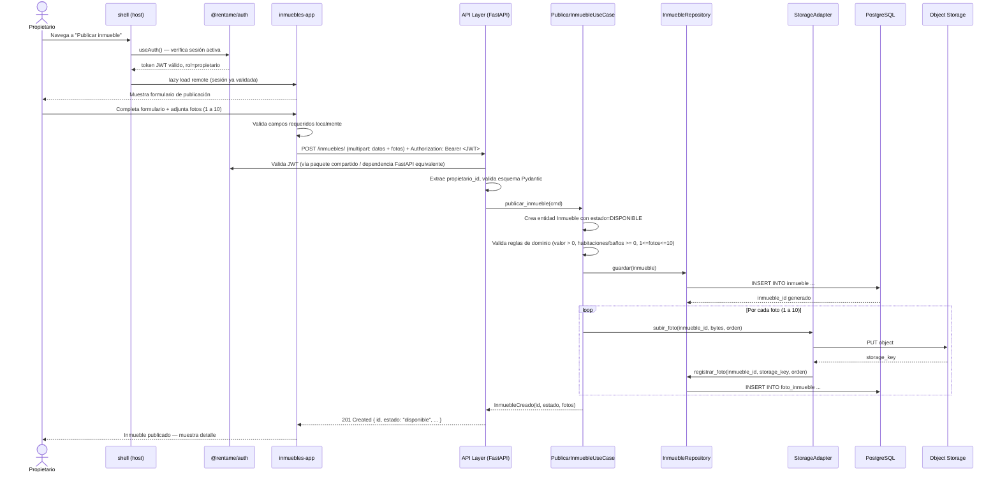

## Context

Este es el change fundacional del dominio `inmuebles`: no existe todavía ningún microfrontend desplegado ni ningún dominio de backend implementado en el repositorio (el código actual del proyecto son solo documentos — PRD, HUs, arquitectura). `docs/architecture/architecture.md` ya define, tras una sesión de exploración previa, que el frontend usa microfrontends (Rspack + Module Federation 2.0) y que la publicación/edición de inmuebles vive en el remote privado `inmuebles-app`, separado de `busqueda-app` (público, HU-003). El backend usa arquitectura hexagonal con slicing por dominio; este change introduce el dominio `backend/inmuebles/`.

Dos cosas que no existen aún y de las que este change depende parcialmente:
- El host `shell` (routing global, layout, guard de sesión).
- El paquete singleton de autenticación `@rentame/auth`.

Ninguno de los dos tiene un change propio todavía. Este change necesita una versión mínima de ambos para poder desplegar `inmuebles-app` de forma útil (ver Decisión 1).

## Goals / Non-Goals

**Goals:**
- Implementar el dominio `inmuebles` en el backend (crear, editar, publicar/despublicar, listar propios, y la operación de cambio a `no_disponible`).
- Implementar el remote `inmuebles-app` con el formulario de publicación/edición y el panel "mis inmuebles".
- Dejar scaffolded lo mínimo indispensable de `shell` y `@rentame/auth` para que `inmuebles-app` pueda autenticar al propietario y montarse en runtime.
- Resolver, para este change, la ambigüedad de mecanismo de subida de fotos que quedó abierta entre `architecture.md` (tabla de decisiones dice presigned URLs) y el diagrama de secuencia de publicación (muestra subida vía backend).

**Non-Goals:**
- Implementar el disparo real de la transición automática a `no_disponible` desde el flujo de arrendamiento (HU-005) — este change solo expone la operación de aplicación que ese flujo invocará más adelante.
- Publicación por agente (HU-002) y búsqueda pública (HU-003) — quedan como changes futuros que extienden la capacidad `inmuebles`.
- Construir un `shell` o `@rentame/auth` completos y reutilizables por todos los remotes futuros — solo lo mínimo que `inmuebles-app` necesita hoy.
- Definir qué pasa cuando un inmueble vuelve de `no_disponible` a `disponible` (fin de contrato) — no está en el alcance de HU-001.

## Decisions

**1. Mecanismo de subida de fotos: proxy por backend (multipart), no presigned URLs**
`architecture.md` tiene una inconsistencia heredada: la tabla de decisiones dice "presigned URLs" pero el diagrama de secuencia de publicación siempre mostró al backend recibiendo los bytes y subiéndolos a S3. Para este change se resuelve a favor del **proxy por backend**: el frontend envía un `multipart/form-data` con los datos del formulario y las fotos en la misma request a `POST /inmuebles/`, y el backend las sube a S3/MinIO vía `StoragePort`. Se prefiere sobre presigned URLs porque evita configurar CORS en el bucket y un endpoint adicional de generación de URLs firmadas — menos piezas para un equipo unipersonal en el primer dominio implementado. Queda como deuda documental actualizar la tabla de decisiones de `architecture.md` para que coincida (no se hace en este change para no tocar arquitectura de nuevo en medio de una propuesta funcional).

**2. Máximo de fotos por inmueble: 10**
El mínimo (1) ya estaba definido en la HU. Se fija el máximo en 10: suficiente para mostrar bien un inmueble (fachada, cada habitación, baños, áreas comunes) sin que el tamaño total de la request multipart o el tiempo de subida se vuelvan un problema en el proxy por backend. Es un valor de configuración (`MAX_FOTOS_INMUEBLE`), no una constante hardcodeada en el dominio, para poder ajustarlo sin tocar reglas de negocio.

**3. Scaffolding mínimo de `shell` y `@rentame/auth` como parte de este change**
No hay otro change que los cubra todavía y `inmuebles-app` no puede probarse end-to-end sin ellos. Se construye la versión mínima: `shell` con router global y un layout privado que exige sesión; `@rentame/auth` con `AuthProvider`, `useAuth` y `AuthGuard`, consumiendo el login/JWT que ya expone `usuarios` según `architecture.md` (fuera del alcance de este change implementar `usuarios` si no existe — se asume que login/JWT ya están disponibles o se scaffoldean con un stub mínimo; ver Open Questions).

**4. La transición automática a `no_disponible` se modela como caso de uso idempotente, no como escucha de eventos**
Dado que `arrendamiento` (HU-005) todavía no existe, no hay bus de eventos ni contrato de mensajería definido en la arquitectura. Se opta por exponer un método de aplicación síncrono (`cambiar_disponibilidad(inmueble_id, nuevo_estado)`) que cualquier caller interno del backend puede invocar directamente (llamada a función, no evento). Cuando se implemente `arrendamiento`, su caso de uso de firma de contrato invocará este método directamente dentro del mismo proceso — más simple que introducir un bus de eventos para un solo consumidor conocido. Si en el futuro aparecen más consumidores de este cambio de estado, se puede revisar hacia un modelo de eventos de dominio.

**5. Autorización por pertenencia (`propietario_id`)**
Todas las operaciones de escritura (crear, editar, publicar/despublicar) y el listado propio validan que el `propietario_id` del JWT coincide con el dueño del inmueble. Sigue el patrón ya establecido en `architecture.md` (JWT → `propietario_id` extraído en la capa API, validado en el caso de uso, no en el router).

## Sequence Diagram — Publicación de inmueble (flujo que toca auth)

## Testing Strategy por componente

- **Dominio `Inmueble` / `FotoInmueble` (backend)**: tests unitarios sin base de datos — reglas de validación (valor > 0, min/max fotos, transición de estados válida/inválida).
- **Casos de uso** (`publicar_inmueble`, `editar_inmueble`, `cambiar_disponibilidad`, `listar_mis_inmuebles`): tests unitarios con repositorio e storage adapter fake/in-memory (Red-Green-Refactor por caso de uso).
- **`InmuebleRepositoryPostgres`**: tests de integración con base de datos de prueba (pytest-asyncio + PostgreSQL de test) — inserción, actualización de estado, filtrado por `propietario_id`.
- **`s3_storage_adapter`**: test de integración contra MinIO local (no mockeado) para validar el contrato real de `PUT object`.
- **Endpoints** (`POST /inmuebles/`, `PUT /inmuebles/{id}`, `PATCH /inmuebles/{id}/disponibilidad`, `GET /inmuebles/mios`): tests de integración vía `TestClient` con JWT válido/inválido/de otro propietario, cubriendo cada scenario de `specs/inmuebles/spec.md`.
- **Formulario de publicación/edición (`inmuebles-app`)**: Jest + React Testing Library — validación de campos requeridos, límite de fotos, estados de carga/error.
- **Panel "mis inmuebles"**: RTL — renderizado de estados (`disponible`/`no_disponible`/`oculto`), listado vacío.
- **`@rentame/auth` (mínimo)**: RTL — `AuthGuard` redirige sin sesión, `useAuth` expone el JWT a `inmuebles-app`.
- **E2E (Playwright / Playwright MCP)**: flujo completo propietario — login → publicar con fotos → ver en "mis inmuebles" como disponible → editar → despublicar → republicar.

## Risks / Trade-offs

- **[Riesgo] El proxy por backend para fotos puede saturar la API con requests multipart grandes** → Mitigación: límite de tamaño por foto (a definir en configuración, ej. 5MB) y máximo de 10 fotos ya fijado; revisar a presigned URLs si el volumen de publicaciones crece.
- **[Riesgo] Construir `shell` y `@rentame/auth` dentro de este change mezcla infraestructura transversal con la funcionalidad de HU-001** → Mitigación: mantenerlos deliberadamente mínimos (Non-Goal explícito arriba) y documentarlos como reutilizables por los remotes futuros, no como algo a rehacer en cada change.
- **[Riesgo] La operación `cambiar_disponibilidad` no tiene todavía un caller real** (arrendamiento no existe) → Mitigación: cubrir con tests que invocan la operación directamente como lo haría el futuro caso de uso de arrendamiento, dejando el contrato validado antes de que exista el consumidor real.
- **[Trade-off] Elegir proxy por backend en vez de presigned URLs contradice la tabla de decisiones original de `architecture.md`** → Aceptado conscientemente por simplicidad para el primer dominio; queda pendiente sincronizar ese documento.

## Migration Plan

1. Nueva migración Alembic: crea `inmueble` y `foto_inmueble` (sin afectar tablas existentes, porque no hay ninguna todavía en producción).
2. Desplegar backend (`inmuebles/` + migración) antes que el frontend, para que la API exista cuando `inmuebles-app` la consuma.
3. Desplegar `shell` mínimo y `@rentame/auth` primero, luego `inmuebles-app` como remote registrado en el `shell`.
4. **Rollback**: `alembic downgrade` de la migración de este change elimina las tablas nuevas sin efecto en otros dominios (no existen todavía). En frontend, remover `inmuebles-app` del config de remotes del `shell` y redesplegar el `shell` sin esa entrada.

## Open Questions

- ¿Un inmueble puede volver de `no_disponible` a `disponible` alguna vez (fin de contrato, inquilino se muda)? No está cubierto por HU-001 ni por este change — probablemente requiere una HU propia sobre fin/renovación de contrato.
- ¿Qué pasa si el propietario despublica (`oculto`) un inmueble que tiene una solicitud de arrendamiento en curso? HU-001 no lo define; este change no lo resuelve porque `arrendamiento` no existe aún — revisar cuando se diseñe HU-005.
- ¿`usuarios` (login/JWT) ya existe como para que `@rentame/auth` lo consuma directamente, o este change necesita un stub de autenticación mínimo? Se asume que existe o se scaffoldea un stub — a confirmar antes de implementar `tasks.md`.
- Nombre final y ownership a largo plazo del paquete `@rentame/auth` y del `shell` una vez que más remotes los consuman — este change los trata como scaffolding mínimo, no como diseño definitivo.
