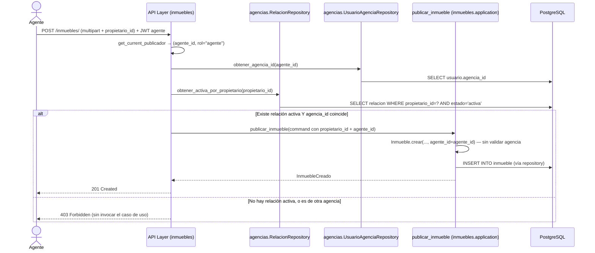

## Context

`backend/inmuebles/` (HU-001) y `backend/agencias/` (HU-007) ya están implementados e independientes: `agencias` conoce y llama a `inmuebles` (para la cascada de despublicación al revocar), pero `inmuebles` no conoce nada de `agencias` — dirección única, fijada deliberadamente en `design.md` de hu-007.

Este change necesita que `inmuebles` autorice a un agente a publicar/editar/cambiar disponibilidad en nombre de un propietario, lo cual requiere preguntarle algo a `agencias` ("¿la agencia de este agente tiene relación activa con este propietario?"). Resolver esto sin invertir la dirección de dependencia entre dominios es la decisión central de este change (ver Decisión 1).

## Goals / Non-Goals

**Goals:**
- Permitir que un agente publique un inmueble en nombre de un propietario con relación `activa` con su agencia.
- Ampliar la autorización de edición y cambio de disponibilidad a nivel agencia (cualquier agente de la agencia con relación activa, no solo quien publicó).
- Nuevo listado `GET /inmuebles/gestionados` para que el agente vea su cartera de inmuebles sin recorrer propietario por propietario.
- Mantener `inmuebles/application` y `inmuebles/domain` sin ninguna dependencia de `agencias`.

**Non-Goals:**
- No se modifica el modelo de `agencias` (HU-007) — este change solo lo consume desde la capa de API de `inmuebles`.
- No se agrega jerarquía ni permisos diferenciados entre agentes de una misma agencia — sigue siendo plano, tal como decidió hu-007.
- No se cambia qué campos son editables ni las reglas de validación de datos del formulario — siguen siendo las de HU-001.
- El frontend de esta HU se limita al selector de propietario en el formulario existente y al nuevo panel de gestionados — no se rediseña `inmuebles-app`.

## Decisions

**1. La autorización cross-domain vive en la capa de API de `inmuebles`, no en sus casos de uso**
El router de `inmuebles` (`infrastructure/api/router.py`), antes de invocar `publicar_inmueble`/`editar_inmueble`/`cambiar_disponibilidad`, consulta directamente los repositorios de `agencias` (inyectados por `Depends`, mismo mecanismo que ya usa `agencias/infrastructure/api/router.py` para inyectar `InmuebleRepositoryPostgres`) para resolver: "¿el llamador (agente) tiene una agencia, y esa agencia tiene una relación `activa` con el `propietario_id` en juego?". Si la respuesta es no, el endpoint rechaza ANTES de llegar al caso de uso. `inmuebles/application` y `inmuebles/domain` no importan nada de `agencias` — se preserva la dirección única de dependencia de hu-007 en ambos sentidos (ninguno de los dos dominios importa código de aplicación del otro; `agencias` solo llama funciones públicas de `inmuebles.application`, e `inmuebles` no llama nada de `agencias.application`, todo el cruce ocurre en la capa de API).

**2. Mismo endpoint, campo opcional — no hay ruta separada para agentes**
`POST /inmuebles/` gana un campo `propietario_id` opcional en el multipart. Nueva dependencia `get_current_publicador` en `shared/infrastructure/auth/dependencies.py` (aditiva — no modifica `get_current_propietario` ni `get_current_agente` existentes), que acepta JWT con rol `propietario` O `agente` y devuelve `(usuario_id, rol)`. El router decide: si `rol == "propietario"`, `propietario_id` efectivo es el propio `usuario_id` (el campo del form, si vino, se ignora). Si `rol == "agente"`, `propietario_id` es obligatorio y se valida contra la relación activa de la Decisión 1.

**3. Autorización a nivel agencia, nunca a nivel `inmueble.agente_id`**
El check siempre es "¿la agencia del agente que llama tiene relación `activa` con `inmueble.propietario_id`?" — nunca "¿`token.sub == inmueble.agente_id`?". Aplica igual a `PUT /inmuebles/{id}` y `PATCH /inmuebles/{id}/disponibilidad`: el router primero obtiene el inmueble (para conocer su `propietario_id` real), luego resuelve autorización (propietario dueño, o agente con agencia activa), y solo entonces invoca el caso de uso — pasándole como `command.propietario_id` el `propietario_id` real del inmueble (no el del JWT). Esto mantiene el chequeo de ownership que ya existe dentro de `editar_inmueble`/`cambiar_disponibilidad` (`inmueble.propietario_id != command.propietario_id`) funcionando sin cambios: para el camino de agente, ese chequeo pasa trivialmente porque el router ya construyó el comando con el `propietario_id` correcto tras autorizar — es defensa en profundidad redundante pero inofensiva, no contradictoria.

**4. El dominio `Inmueble` no valida nada de `agencias`**
`Inmueble.crear()` gana `agente_id: uuid.UUID | None = None` como parámetro simple, sin ninguna regla de negocio nueva (no valida que `agente_id != propietario_id` ni nada de relaciones — eso ya se resolvió en la API). El dominio solo almacena el dato.

**5. `agente_id` es inmutable después de la creación**
`editar_inmueble` no toca `agente_id` bajo ninguna circunstancia — sigue reflejando siempre quién publicó originalmente, incluso si lo edita otro agente de la misma agencia. Es dato de auditoría, no de autorización (la autorización ya se resuelve en la Decisión 3 sin mirar este campo).

**6. `GET /inmuebles/gestionados`: nuevo caso de uso, mismo patrón que `listar_mis_inmuebles`**
Nuevo caso de uso `listar_inmuebles_gestionados(agente_id, *, repository)` en `inmuebles/application/` — pero como necesita saber "qué propietarios tienen relación activa con la agencia de este agente", ese listado de propietarios se resuelve en la capa de API (consultando `agencias`) y se le pasa al caso de uso como una lista de `propietario_id` ya resuelta (el caso de uso solo hace `repository.listar_por_propietarios(ids)` — un método nuevo en `InmuebleRepositoryPort`/`InmuebleRepositoryPostgres`, sin que el caso de uso necesite saber de dónde vino esa lista). Mismo patrón de la Decisión 1: la orquestación cross-domain vive en la API, el caso de uso recibe datos ya resueltos.

## Sequence Diagram — Agente publica en nombre de un propietario (flujo que toca auth)

## Testing Strategy por componente

- **Dominio `Inmueble.crear(agente_id=...)`**: test unitario — acepta `agente_id` opcional, default `None`, sin validación adicional.
- **`get_current_publicador`**: test unitario — acepta JWT con rol `propietario` o `agente`, rechaza cualquier otro rol o token inválido/ausente.
- **Casos de uso** (`publicar_inmueble`, `editar_inmueble`, `cambiar_disponibilidad`, `listar_inmuebles_gestionados`): tests unitarios con fakes — confirman que NO importan nada de `agencias` (revisión de imports, no solo tests) y que `agente_id` no cambia en `editar_inmueble`.
- **Nuevo método de repositorio** `InmuebleRepositoryPostgres.listar_por_propietarios(ids)`: test de integración contra Postgres real.
- **Endpoints** (`POST /inmuebles/`, `PUT /inmuebles/{id}`, `PATCH /inmuebles/{id}/disponibilidad`, `GET /inmuebles/gestionados`): tests de integración vía `TestClient` con Postgres real, cubriendo los escenarios de `specs/inmuebles/spec.md` de este change — agente con relación activa (éxito), agente sin relación activa (403), agente de otra agencia editando (403), propietario dueño (sin cambios respecto a HU-001).
- **Frontend** (`inmuebles-app`): tests RTL para el selector de propietario condicional por rol en `PublicarInmueblePage`/`EditarInmueblePage`, y para el nuevo panel de inmuebles gestionados.

## Risks / Trade-offs

- **[Riesgo] Duplicar la resolución de "propietario_id real" entre la API y el caso de uso** (Decisión 3) **podría desincronizarse si alguien edita solo un lado** → Mitigación: cubrir con un test de integración que ejercite el camino completo (API real + caso de uso real + Postgres real), no solo unitarios con fakes de cada lado por separado.
- **[Riesgo] Consultar `agencias` desde la capa de API de `inmuebles` en cada request de escritura agrega latencia (2-3 queries extra)** → Aceptado: es coherente con mantener los dominios desacoplados; se puede optimizar más adelante con una vista materializada o caché si el volumen lo justifica — no se resuelve en este change (no hay problema de performance real todavía, el proyecto no está en producción).
- **[Trade-off] El chequeo de ownership dentro de `editar_inmueble`/`cambiar_disponibilidad` se vuelve parcialmente redundante para el camino de agente** (Decisión 3) → Aceptado deliberadamente: mantiene esos casos de uso sin ninguna rama especial para agentes, a costa de una validación que siempre pasa en ese camino.

## Migration Plan

1. Migración Alembic: ninguna estructural nueva — `Inmueble.agente_id`/columna ya existen desde HU-007. Solo cambia código de aplicación/API.
2. Desplegar backend con los endpoints ampliados; el frontend puede desplegarse después sin romper nada (los campos nuevos son opcionales, el comportamiento de propietario no cambia).
3. **Rollback**: revertir el código de este change no requiere rollback de datos — ningún inmueble existente pierde información (los que ya tenían `agente_id=None` siguen igual).

## Open Questions

- ¿`GET /inmuebles/gestionados` necesita paginación desde ya, o alcanza con devolver todo (como `listar_mis_inmuebles` hoy)? Se resuelve igual que HU-001: sin paginación por ahora, dado el volumen esperado del MVP.
- ¿El selector de propietario en el frontend debe mostrar el nombre del propietario, o solo su id? Requiere que `GET /agencias/mia/propietarios` (ya existente) devuelva datos suficientes del propietario (hoy solo devuelve ids/estado) — a resolver en tasks.md si hace falta ampliar ese endpoint (fuera del alcance estricto de esta HU, pero podría ser un ajuste chico dentro de la sección de frontend).
