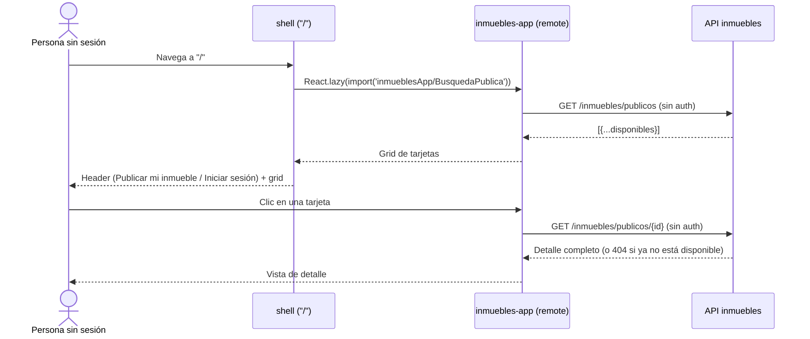

## Context

`backend/inmuebles/` ya tiene el dominio completo (`Inmueble`, `EstadoInmueble`, `InmuebleRepositoryPostgres`) desde HU-001, con listados privados por propietario (`GET /inmuebles/mios`) y por agencia (`GET /inmuebles/gestionados`), ambos autenticados. Nunca existió un listado sin autenticación.

En frontend, `frontend/shell/src/App.tsx` monta `EntradaPage` (HU-008: elegir rol) como landing (`/`) — decisión correcta cuando no existía nada público que mostrar. Ahora que se construye el listado público, la landing cambia de dueño: pasa a ser el listado de inmuebles, y `EntradaPage` se reubica detrás de un botón "Publicar mi inmueble".

## Goals / Non-Goals

**Goals:**
- Listado y detalle de inmuebles `disponible`, sin autenticación, reusando el dominio `Inmueble` existente sin modificarlo.
- La landing del `shell` (`/`) pasa a ser este listado; `EntradaPage`/`LoginPage` quedan accesibles desde un header, no como landing.

**Non-Goals:**
- Filtros de búsqueda (ciudad/barrio, precio, habitaciones, tipo) — diferido a una iteración futura (`docs/user-stories/HU-003-busqueda-inmuebles-disponibles.md`).
- Botón "iniciar solicitud de arrendamiento" desde el detalle — bloqueado por HU-005 (dominio de arrendamiento), que no existe todavía.
- No se modifica `inmuebles/domain` ni los endpoints/casos de uso privados ya existentes.

## Decisions

**1. Dos casos de uso nuevos, de solo lectura, sin tocar el dominio**
`backend/inmuebles/application/listar_inmuebles_publicos.py` y `obtener_inmueble_publico.py` — ambos reciben el repositorio inyectado por parámetro (mismo patrón que el resto del proyecto) y filtran/validan por `estado == EstadoInmueble.DISPONIBLE`. `obtener_inmueble_publico` devuelve `None` (→ 404 en el router) si el inmueble no existe o no está disponible — nunca revela que existe pero está oculto.

**2. Nuevo método de repositorio: `listar_disponibles()`**
En `InmuebleRepositoryPostgres`, un método adicional `listar_disponibles() -> list[Inmueble]` (filtra `estado == 'disponible'`, sin paginación en esta v1 dado el volumen esperado). `obtener_por_id` ya existente se reutiliza para el detalle; el caso de uso público valida el estado después de obtenerlo (no se necesita un método de repositorio nuevo para el detalle).

**3. Endpoints públicos con path propio, no reutilizando `/inmuebles/`**
`GET /inmuebles/publicos` y `GET /inmuebles/publicos/{id}` en `backend/inmuebles/infrastructure/api/router.py`, sin `Depends` de autenticación. Se prefirió un path separado (en vez de hacer que `GET /inmuebles/` sirva ambos casos según haya o no JWT) para no mezclar semántica pública/privada en la misma ruta — decisión cerrada en la exploración.

**4. Schema de respuesta pública distinto al privado**
Nuevo `InmueblePublicoResponse`/`InmueblePublicoListItemResponse` en `schemas.py`, separados de los que ya usan `/mios`/`/gestionados` — igual que se hizo con `AgenciaBuscarResponse` en HU-008: un schema público separado evita que un campo sensible agregado a futuro al schema privado se filtre por accidente en el endpoint público.

**5. El listado/detalle público vive en `inmuebles-app`, no en `shell`**
Nuevo componente `BusquedaPublica` expuesto vía Module Federation (`exposes` en `frontend/inmuebles-app/rspack.config.ts`), reusando `inmuebles.api.ts` ya existente (se le agregan `listarPublicos()`/`obtenerPublico(id)`). Mantiene todo el dominio `Inmueble` en un solo microfrontend — igual razón que llevó a que `PropertyRoutes` (gestión autenticada) viva ahí. `shell` solo monta el header (con "Publicar mi inmueble"/"Iniciar sesión") alrededor del componente lazy-cargado.

**6. Reestructuración de rutas en `shell`**
```
Antes (HU-008)                          Después (HU-003)
/                → EntradaPage           /                → BusquedaPublicaPage (header + BusquedaPublica lazy)
/login           → LoginPage             /login           → LoginPage (sin cambios)
/registro/*      → RegistroPage          /publicar        → EntradaPage (reubicada)
                                         /registro/*      → RegistroPage (sin cambios)
```
`EntradaPage` no se modifica internamente — solo cambia la ruta que la monta y cómo se llega a ella (antes landing directa, ahora vía botón).

## Sequence Diagram — Carga de la landing pública



## Testing Strategy por componente

- **Casos de uso** (`listar_inmuebles_publicos`, `obtener_inmueble_publico`): tests unitarios con fake repository — solo devuelve `disponible`, detalle de no-disponible devuelve `None`.
- **Repositorio** (`listar_disponibles`): test de integración contra Postgres real — mezcla de estados, verifica que solo devuelve `disponible`.
- **Endpoints** (`GET /inmuebles/publicos`, `GET /inmuebles/publicos/{id}`): tests de integración vía `TestClient`, sin header de `Authorization`, cubriendo los escenarios de `specs/inmuebles/spec.md` de este change (incluye el 404 de un inmueble oculto).
- **Frontend** (`inmuebles-app`): tests RTL de `BusquedaPublica` — lista con datos mockeados, clic navega al detalle, detalle muestra todas las fotos.
- **Frontend** (`shell`): tests RTL de la nueva página que compone el header — verifica que `/publicar` monta `EntradaPage`, que el header tiene los 2 links/botones correctos.
- **E2E**: visitante sin sesión ve el listado con los inmuebles sembrados, entra al detalle de uno, vuelve, hace clic en "Publicar mi inmueble" y llega al flujo de registro ya existente; verifica que un inmueble oculto/no_disponible no aparece.

## Risks / Trade-offs

- **[Riesgo] Sin paginación, un catálogo grande de inmuebles podría ser lento** → Aceptado para v1 dado el volumen esperado (mismo criterio ya usado en los demás listados del proyecto); paginación queda para cuando el volumen lo justifique.
- **[Trade-off] Dos schemas de respuesta (público/privado) para el mismo `Inmueble`** → Duplica algo de código de serialización, pero evita fugas de datos futuras — mismo patrón ya aceptado en HU-008 (`AgenciaBuscarResponse`).

## Migration Plan

1. Backend: desplegar los 2 endpoints nuevos (aditivos puros, sin migración de datos).
2. Frontend: desplegar `inmuebles-app` con `BusquedaPublica` expuesto, luego `shell` con la landing reestructurada (orden importa: si `shell` se despliega primero, el remote todavía no expone el componente — usar el mismo pipeline de build que ya usa Docker Compose, sin necesidad de coordinación especial ya que ambos se buildean juntos en este proyecto).
3. **Rollback**: revertir `shell` a montar `EntradaPage` en `/` no requiere revertir el backend ni `inmuebles-app` (los endpoints nuevos quedan sin uso, sin efecto).

## Open Questions

Ninguna — todas las decisiones de alcance y arquitectura se cerraron en `/opsx:explore HU-003`.
