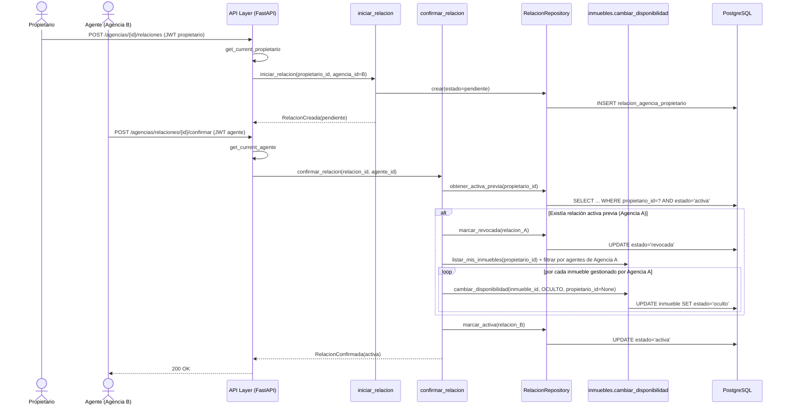

## Context

`backend/inmuebles/` (HU-001) ya está implementado: dominio, casos de uso, persistencia, API, con un stub mínimo de `usuarios` (tabla `usuario` con `id`, `email`, `rol`, `creado_en`, sin registro/login real) y JWT emitido manualmente. `inmueble` ya tiene una columna `agente_id` (FK a `usuario`, nullable) prevista desde la migración original de HU-001, pero ningún caso de uso la usa todavía — ni el dominio `Inmueble.crear` la acepta.

Este change agrega el dominio `agencias`, del que depende HU-002 (publicación por agente) para poder autorizar a un agente a actuar sobre los inmuebles de un propietario. Este change NO modifica `publicar_inmueble` ni `editar_inmueble` de `inmuebles` — esos siguen aceptando solo al propietario dueño, igual que en HU-001. Solo se agrega un nuevo caller de la operación ya existente `cambiar_disponibilidad(propietario_id=None)` (decisión 4 de `design.md` de `hu-001`, pensada exactamente para este tipo de disparo entre dominios).

## Goals / Non-Goals

**Goals:**
- Modelar `Agencia` como entidad propia, con membresía de agentes (cardinalidad 1 agente : 1 agencia).
- Modelar la relación `agencia_propietario` con su máquina de estados (`pendiente`/`activa`/`revocada`), iniciada por el propietario, con como máximo una activa por propietario.
- Flujo de ingreso de un agente a una agencia existente con aprobación de un miembro, y salida voluntaria con el bloqueo de último-miembro-con-relaciones-activas.
- Puntero de agente responsable, reasignable, sin efecto en autorización.
- Disparar la despublicación en cascada de los inmuebles gestionados por una agencia cuando su relación con un propietario se revoca (explícita o por reemplazo automático).

**Non-Goals:**
- No se construye el formulario de publicación por agente ni ningún endpoint de `inmuebles` que acepte a un agente como autor — eso es HU-002.
- No se construye ninguna UI (frontend) — este change es backend-only. Dónde vive la UI de gestión de agencias (remote nuevo vs. sección de `inmuebles-app`) se decide en el change de HU-002 o en uno posterior.
- No se modela jerarquía interna de agencia (admin/gerente) — decisión ya tomada, no se reabre.
- No se modela membresía N:N agente-agencia — un agente pertenece a exactamente una agencia.
- No se implementa notificación (email) de cambios de estado — no está en los criterios de aceptación de HU-007.

## Decisions

**1. Nuevo dominio `backend/agencias/`, hexagonal, igual patrón que `inmuebles`**
- `domain/agencia.py`: entidad `Agencia` (razón social, NIT).
- `domain/relacion_agencia_propietario.py`: entidad con estados y transiciones (`activar`, `revocar`), agente responsable.
- `domain/solicitud_ingreso.py`: entidad de la solicitud de ingreso a agencia existente (`pendiente`/`aprobada`).
- `domain/ports.py`: `AgenciaRepositoryPort`, `RelacionRepositoryPort`, `SolicitudIngresoRepositoryPort`.
- `domain/exceptions.py`: `AgenteYaTieneAgencia`, `AgenciaNoEncontrada`, `UltimoAgenteConRelacionesActivas`, `SolicitudNoEncontrada`, `RelacionYaActiva`, etc.

**2. `usuario.agencia_id` en vez de tabla de membresía separada**
Dado que la cardinalidad es 1 agente : 1 agencia (decisión ya tomada), una columna nullable en `usuario` alcanza — no hace falta una tabla intermedia N:N. Se agrega vía migración Alembic, sin tocar el resto del esquema de `usuario`.

**3. Auto-revocación al activar una nueva relación, y cascada de despublicación, en una sola transacción**
`confirmar_relacion` (agente confirma la relación que inició el propietario) hace, dentro de la misma transacción de base de datos:
1. Busca si el propietario ya tiene otra relación `activa` con otra agencia.
2. Si existe, la marca `revocada` y dispara la cascada de despublicación para esa agencia-propietario (ver decisión 4).
3. Activa la nueva relación.

Se evita así una ventana de inconsistencia donde el propietario tendría (o no tendría) dos agencias activas momentáneamente.

**4. La cascada de despublicación vive en `agencias/application/`, no en `inmuebles`**
El caso de uso `revocar_relacion` (y el auto-revoke de la decisión 3) hace, después de marcar la relación `revocada`:
1. Consulta qué agentes pertenecen a la agencia revocada (`usuario.agencia_id = agencia_id`).
2. Llama a `inmuebles.application.listar_mis_inmuebles(propietario_id)` (ya existe, de HU-001) y filtra, en el propio caso de uso de `agencias`, los inmuebles cuyo `agente_id` esté en el conjunto de agentes de la agencia.
3. Por cada uno, llama a `inmuebles.application.cambiar_disponibilidad(inmueble_id, OCULTO, propietario_id=None)` — el mismo caso de uso de HU-001, con el mismo path de "operación de sistema" ya diseñado para este propósito, sin agregarle nada.

Esto mantiene `inmuebles` sin saber nada de `agencias` (la dependencia va en un solo sentido: `agencias` conoce y llama a `inmuebles`, nunca al revés), consistente con que `inmuebles` ya expone `cambiar_disponibilidad` como "el punto de integración que otros dominios invocarán" (tal cual se documentó en `design.md` de `hu-001`).

**5. Nueva dependencia de autenticación `get_current_agente`, sin tocar `get_current_propietario`**
Paralela a la ya existente en `shared/infrastructure/auth/dependencies.py`, valida JWT y rechaza si `rol != "agente"`. Se agrega en el mismo archivo, sin modificar la función existente (protege los 55 tests de backend de HU-001 de cualquier regresión).

**6. Validación de pertenencia a agencia dentro de los casos de uso, no en la dependencia HTTP**
Igual que `editar_inmueble` valida ownership dentro del caso de uso (no en la capa de API), aprobar un ingreso o confirmar/revocar una relación valida "¿el agente que llama pertenece a esta agencia puntual?" dentro del caso de uso — la dependencia HTTP solo resuelve "es un agente autenticado", no cuál agencia.

## Sequence Diagram — Contratar agencia y reemplazo automático (flujo que toca auth)

## Testing Strategy por componente

- **Dominio** (`Agencia`, `RelacionAgenciaPropietario`, `SolicitudIngreso`): tests unitarios sin base de datos — transiciones de estado válidas/inválidas (no se puede confirmar una relación ya revocada, no se puede activar dos veces, etc.).
- **Casos de uso** (`crear_agencia`, `solicitar_ingreso`, `aprobar_ingreso`, `salir_de_agencia`, `iniciar_relacion`, `confirmar_relacion`, `revocar_relacion`, `reasignar_responsable`): tests unitarios con repositorios fake, igual patrón que `inmuebles/application` de HU-001. Los tests de `confirmar_relacion`/`revocar_relacion` usan un fake de las funciones de aplicación de `inmuebles` (`listar_mis_inmuebles`, `cambiar_disponibilidad`) para verificar que se invocan con los argumentos correctos, sin necesitar el dominio `inmuebles` real.
- **Repositorios** (`AgenciaRepositoryPostgres`, etc.): tests de integración contra Postgres real, mismo patrón que `InmuebleRepositoryPostgres`.
- **Endpoints** (`POST /agencias/`, `POST /agencias/{id}/solicitudes`, `POST /agencias/solicitudes/{id}/aprobar`, `POST /agencias/salir`, `POST /agencias/{id}/relaciones`, `POST /agencias/relaciones/{id}/confirmar`, `POST /agencias/relaciones/{id}/revocar`, `PATCH /agencias/relaciones/{id}/responsable`, `GET /agencias/mia/propietarios`): tests de integración vía `TestClient` contra Postgres real, cubriendo los escenarios de `specs/agencias/spec.md` y `specs/inmuebles/spec.md` (la despublicación en cascada, verificada consultando el estado real del inmueble después del request).
- **Cascada de despublicación**: test de integración de extremo a extremo (Postgres real): crear agencia, relación activa, un inmueble con `agente_id` de esa agencia, revocar la relación, verificar que el inmueble queda `oculto`; y un segundo inmueble del mismo propietario sin agente (publicado directo) que NO cambia de estado.

## Risks / Trade-offs

- **[Riesgo] La cascada de despublicación podría despublicar inmuebles equivocados si el filtro "agentes de la agencia" está mal** → Mitigación: el escenario negativo (inmuebles publicados directo por el propietario no se ven afectados) está explícito en `specs/inmuebles/spec.md` y debe cubrirse con test de integración real, no solo unitario con fakes.
- **[Riesgo] Condición de carrera entre activar una relación nueva y revocar la anterior** → Mitigación: ambas operaciones (revocar A + activar B) ocurren en una sola transacción de base de datos (decisión 3).
- **[Trade-off] Este dominio queda inerte para uso real hasta que HU-002 exista** — ningún flujo permite hoy que un agente publique o edite un inmueble; `agente_id` en `inmuebles` seguirá siempre `NULL` hasta ese change. Aceptado explícitamente (non-goal), mismo patrón que HU-001 dejó `cambiar_disponibilidad(propietario_id=None)` listo antes de que `arrendamiento` (HU-005) exista.
- **[Riesgo] Agregar `get_current_agente` sin tocar `get_current_propietario`** → Mitigación: se agrega como función nueva en el mismo archivo; correr la suite completa de `inmuebles` (55 tests) sin modificaciones para confirmar cero regresión.

## Migration Plan

1. Nueva migración Alembic: tablas `agencia`, `solicitud_ingreso_agencia`, `relacion_agencia_propietario`, más columna `usuario.agencia_id` (FK nullable).
2. Desplegar backend con el nuevo dominio; no requiere cambios de frontend (non-goal).
3. **Rollback**: `alembic downgrade` elimina las tablas y la columna nuevas. Sin impacto en `inmuebles` ni `usuarios`, porque ningún dato real depende de ellas todavía (no hay agentes operando en producción).

## Open Questions

- ¿Dónde vive la UI de gestión de agencias (remote nuevo, o sección de `inmuebles-app`)? Diferido a HU-002 o a un change de frontend posterior.
- ¿Debe notificarse por email al propietario/agencia cuando cambia el estado de una relación? No está en los criterios de aceptación de HU-007; no se resuelve en este change.
- ¿Qué pasa si un agente responsable reasignado ya no pertenece a la agencia en el momento de una consulta histórica? No debería ocurrir dado que `reasignar_responsable` valida pertenencia al momento de reasignar, pero no hay limpieza automática si ese agente sale después — el puntero quedaría apuntando a un ex-miembro. Aceptado como limitación conocida (es solo trazabilidad, no autorización).
