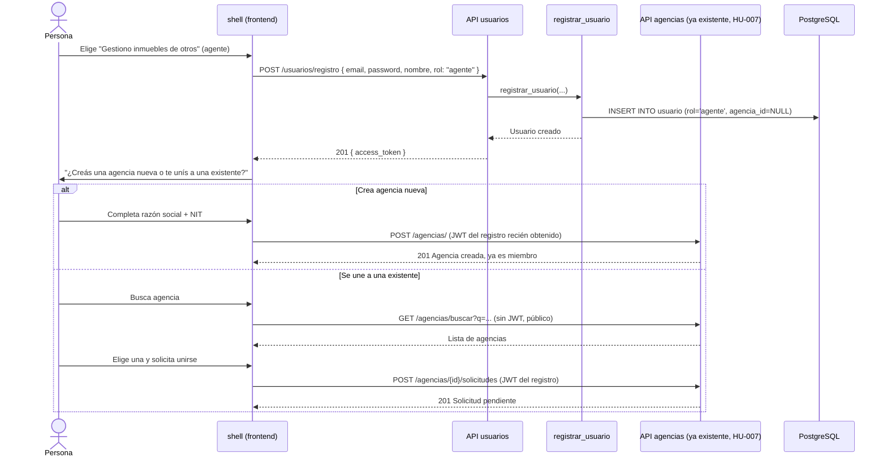

## Context

`backend/usuarios/` hoy es un stub mínimo de HU-001: solo `UsuarioORM` (id, email, rol, creado_en, agencia_id agregado en HU-007) y un `jwt_handler`/`dependencies.py` compartidos en `shared/infrastructure/auth/` que validan JWTs ya emitidos — pero nada emite esos JWTs de forma real. Este change construye el dominio `usuarios` completo (registro, login) reutilizando el `jwt_handler` existente sin modificarlo.

`agencias` (HU-007) y su integración con `inmuebles` (HU-002) ya establecieron el patrón: la orquestación cross-domain vive en la capa de API, nunca en `application`/`domain`. Este change lo extiende una vez más, con una simplificación importante (ver Decisión 1).

## Goals / Non-Goals

**Goals:**
- Registro real por rol (propietario/agente/inquilino) con email+contraseña, login que emite JWT.
- El registro de agente incluye, como parte del mismo flujo de usuario, resolver la pertenencia a una agencia (crear o solicitar unirse).
- Nuevo endpoint público de búsqueda de agencias, para que ese flujo pueda encontrar una agencia existente.
- Reemplazar `TokenLoginPage` (herramienta de desarrollo) por la pantalla de entrada real en `shell`.

**Non-Goals:**
- Verificación de email, recuperación de contraseña, refresh tokens, cambio de rol, multi-rol — todos fuera de alcance, ya decidido en HU-008 (HU de producto).
- No se modifica `shared/infrastructure/auth/jwt_handler.py` ni `dependencies.py` — el contrato del JWT que HU-001/002/007 ya validan se mantiene intacto.

## Decisions

**1. El paso de agencia del registro de agente NO se orquesta en el backend — es un flujo de frontend que encadena endpoints ya existentes**
Al analizar el diseño, la alternativa de "orquestar desde `usuarios/infrastructure/api`" (como se sugería en `proposal.md`) resultó innecesaria: `POST /agencias/` (crear agencia) y `POST /agencias/{id}/solicitudes` (solicitar ingreso) YA EXISTEN desde HU-007 y ya aceptan JWT de agente. El flujo real es:
1. Frontend llama `POST /usuarios/registro` (rol=agente) → recibe JWT.
2. Con ese JWT, el frontend llama inmediatamente `POST /agencias/` o `POST /agencias/{id}/solicitudes`, según lo que la persona eligió en el mismo formulario.

Esto significa que `backend/usuarios/` no necesita importar ni conocer nada de `agencias` — la única pieza de backend nueva relacionada a agencias es el endpoint de búsqueda (Decisión 4), que vive en `agencias/infrastructure/api`, no en `usuarios`. Es una simplificación real respecto a lo que `proposal.md` insinuaba, y reduce la superficie de este change.

**2. Contraseñas con `bcrypt`**
Hash con `bcrypt` (vía `passlib` o el paquete `bcrypt` directo — decisión de implementación menor, a definir en tasks.md). `Usuario.password_hash` nunca se expone en ninguna respuesta de API.

**3. Un solo endpoint de registro, con forma condicional por rol (mismo patrón que HU-002)**
`POST /usuarios/registro` acepta `{ email, password, nombre, rol }` para `propietario`/`inquilino`. Para `rol="agente"`, el mismo endpoint no requiere ningún campo adicional de agencia — el registro en sí solo crea la cuenta con `rol="agente"` y `agencia_id=NULL`; el paso de agencia ocurre después, con los endpoints ya existentes de `agencias` (Decisión 1). El frontend es responsable de no dejar "colgado" a un agente sin agencia — mostrando el paso siguiente inmediatamente tras el registro exitoso.

**4. Nuevo endpoint de búsqueda pública de agencias**
`GET /agencias/buscar?q=<texto>` en `agencias/infrastructure/api/router.py`, sin autenticación, búsqueda case-insensitive sobre `razon_social`/`nit` (ej. `ILIKE '%<texto>%'`). Nuevo método en `AgenciaRepositoryPort`/`AgenciaRepositoryPostgres` (`buscar(texto)`), sin tocar `agencias/application` (es una consulta de solo lectura, no amerita un caso de uso propio si el router puede llamar al repositorio directo — a definir en tasks.md si se prefiere un caso de uso `buscar_agencias` por consistencia con el resto del proyecto, que sí usa casos de uso para todo; se recomienda mantener la consistencia y sí crear el caso de uso, aunque sea un pass-through).

**5. Login rechaza sin distinguir el dato incorrecto**
`autenticar_usuario(email, password)` devuelve la entidad `Usuario` en éxito, o levanta una única excepción `CredencialesInvalidas` (nunca `UsuarioNoEncontrado` expuesto por separado) tanto si el email no existe como si la contraseña no coincide con el hash — mismo mensaje de error en ambos casos, para no filtrar qué emails están registrados.

**6. Migración de datos: `usuario` gana `password_hash` y `nombre`**
Ambas columnas nuevas, nullable inicialmente (para no romper las filas de prueba insertadas manualmente en sesiones anteriores de desarrollo) — aunque `registrar_usuario` siempre las va a poblar para cuentas nuevas creadas a partir de este change.

## Sequence Diagram — Registro de agente + paso de agencia (flujo que toca auth)

## Testing Strategy por componente

- **Dominio** (`Usuario` con `password_hash`): tests unitarios — hash/verificación de contraseña, no expone el hash en ninguna serialización.
- **Casos de uso** (`registrar_usuario`, `autenticar_usuario`, `buscar_agencias`): tests unitarios con fakes — rechazo de email duplicado, rechazo de credenciales inválidas sin distinguir el motivo, rol fijo al crear.
- **Repositorio** (`buscar` en `AgenciaRepositoryPostgres`): test de integración contra Postgres real.
- **Endpoints** (`POST /usuarios/registro`, `POST /usuarios/login`, `GET /agencias/buscar`): tests de integración vía `TestClient`, cubriendo todos los escenarios de `specs/usuarios/spec.md` y `specs/agencias/spec.md` de este change.
- **Frontend** (`shell`): tests RTL para la pantalla de entrada (3 opciones), los 3 formularios de registro, login, y el paso de agencia del flujo de agente (crear vs. buscar y unirse).
- **E2E**: registro de propietario end-to-end; registro de agente creando agencia nueva; registro de agente uniéndose a una existente (con un segundo agente aprobando).

## Risks / Trade-offs

- **[Riesgo] Un agente puede quedar registrado sin completar el paso de agencia** (si abandona el flujo antes de crear/unirse) → Mitigación: no es un estado inconsistente — el modelo ya soporta `usuario.agencia_id = NULL` para un agente (es el estado real hoy, antes de HU-007 nadie lo tenía). El agente puede volver a loguearse y completar el paso de agencia en cualquier momento posterior con los endpoints ya existentes.
- **[Riesgo] Mensajes de error de login demasiado genéricos dificultan el soporte** → Aceptado deliberadamente por seguridad (no revelar qué emails existen), consistente con la decisión de producto.
- **[Trade-off] No hay verificación de email ni recuperación de contraseña** → Aceptado explícitamente para el MVP; si alguien olvida su contraseña, no hay flujo de recuperación todavía (a comunicar como limitación conocida).

## Migration Plan

1. Migración Alembic: agrega `password_hash` (nullable) y `nombre` (nullable) a `usuario`.
2. Desplegar backend con `usuarios/registro` y `usuarios/login`; desplegar frontend con la pantalla de entrada real reemplazando `TokenLoginPage`.
3. **Rollback**: revertir el código no requiere revertir la migración (columnas nullable, no rompen nada existente); si se revierte la migración, las filas de usuario creadas por este change perderían `password_hash`/`nombre` — aceptable solo en un rollback completo de emergencia, documentado como tal.

## Open Questions

- ¿`buscar_agencias` necesita paginación? Se asume que no, dado el volumen esperado del MVP (mismo criterio que el resto de los listados del proyecto).
- ¿El JWT de un agente recién registrado sin agencia debería tener algún claim adicional (`agencia_id: null`) para que el frontend sepa mostrar el paso pendiente sin una llamada extra? Se deja a criterio de implementación en tasks.md — no es un cambio de contrato obligatorio, el frontend puede resolverlo con una llamada a `GET /agencias/mia/propietarios` o revisando el estado tras el registro.
