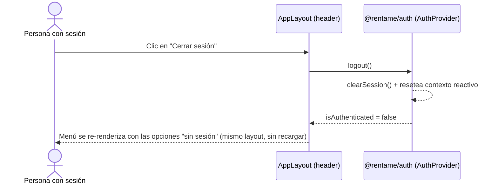

## Context

`@rentame/design-tokens` existe y está parcialmente aplicado (colores/radios en algunas páginas de `shell` e `inmuebles-app`, agregado en un pase anterior de esta misma sesión). No existe ningún layout compartido: `BusquedaPublicaShellPage.tsx` (HU-003) tiene su propio header inline con lógica de sesión (Publicar/Mis inmuebles/Iniciar sesión/Cerrar sesión) que solo se renderiza en "/" — ninguna otra página (`LoginPage`, `RegistroPage`, `EntradaPage`, `/mis-inmuebles`) tiene header ni footer. La navegación dentro de la gestión de inmuebles (`PropertyRoutes`/`BusquedaPublicaRoutes` en `inmuebles-app`) usa una máquina de estados local con botones "Volver"/"Publicar nuevo inmueble", sin rutas — eso no cambia en este change.

## Goals / Non-Goals

**Goals:**
- Un `AppLayout` único en `shell` que renderiza header+footer alrededor de cualquier ruta, consciente de la sesión.
- Restyle consistente con tokens en las páginas que hoy no los usan o los usan parcialmente.
- Extraer la lógica de sesión del header (hoy atrapada dentro de `BusquedaPublicaShellPage`) a un lugar reusable por todas las rutas.

**Non-Goals:**
- No se agregan rutas nuevas ni se cambia el árbol de información de la app.
- No se convierte la navegación interna de `inmuebles-app` (lista/publicar/editar) a rutas de React Router — sigue siendo estado local, per design.md de HU-001/HU-003.
- No se crea un paquete de componentes UI compartido entre `shell` e `inmuebles-app` — cada microfrontend sigue siendo independiente (mismo criterio ya usado para `agencias.api.ts` duplicado en ambos).

## Decisions

**1. `AppLayout` vive en `shell`, envuelve el árbol de rutas completo vía `<Outlet/>`**
Nuevo `frontend/shell/src/layouts/AppLayout.tsx`: header (marca "Rentame" + menú) + `<Outlet/>` + footer. `App.tsx` se reestructura para que **todas** las rutas (`/`, `/login`, `/registro/*`, `/publicar`, y el árbol protegido de `/mis-inmuebles`) sean hijas de una única `<Route element={<AppLayout/>}>`. `PrivateLayout` (que ya existe, con `AuthGuard`) se mantiene como un nivel adicional solo para las rutas protegidas, anidado dentro de `AppLayout`.

**2. La lógica de sesión del menú se mueve de `BusquedaPublicaShellPage` a `AppLayout`**
`BusquedaPublicaShellPage` pierde su header propio (duplicaría el del layout) y queda reducida a solo el `Suspense`+lazy-load de `inmueblesApp/BusquedaPublicaRoutes`. El menú de `AppLayout` usa `useAuth()` (`isAuthenticated`, `logout`) — mismo patrón ya probado en el fix de sesión anterior, ahora centralizado en un solo lugar en vez de duplicado por página.

**3. Menú: "Inicio" siempre visible, resto condicional por sesión**
Sin sesión: "Inicio" (`/`), "Publicar mi inmueble" (`/publicar`), "Iniciar sesión" (`/login`). Con sesión: "Inicio" (`/`), "Mis inmuebles" (`/mis-inmuebles`), "Cerrar sesión" (invoca `logout()`). "Inicio" siempre lleva a la landing pública, sesión o no — ver útil incluso logueado (explorar el listado público no requiere cerrar sesión).

**4. Botones compartidos vía un archivo local de estilos por microfrontend, no un paquete nuevo**
Cada microfrontend gana un `src/styles/buttons.ts` local (`primaryButtonStyle`, `secondaryButtonStyle`, construidos con `var(--color-primary)`/`var(--color-border)`/`var(--radius-card)`), para no repetir el mismo objeto de estilo en cada archivo de página. No se comparte entre `shell` e `inmuebles-app` — cada uno define el suyo (duplicación mínima y deliberada, mismo criterio que `agencias.api.ts`).

**5. Sin tokens nuevos salvo necesidad real**
El pase de restyle usa los tokens ya existentes. Si durante la implementación aparece una necesidad real de un tono adicional (ej. "neutral"/"warning", ya detectados como faltantes en el pase anterior — ver `PropertyRoutes`/`InmueblesGestionadosPage` badges de estado `oculto`), se documenta como decisión puntual en el momento, sin bloquear el resto del change.

## Sequence Diagram — Cerrar sesión desde el menú del layout

## Testing Strategy por componente

- **`AppLayout`** (`shell`): tests RTL — sin sesión muestra "Inicio"/"Publicar mi inmueble"/"Iniciar sesión"; con sesión muestra "Inicio"/"Mis inmuebles"/"Cerrar sesión"; clic en "Cerrar sesión" limpia la sesión y el menú se actualiza reactivamente; el `<Outlet/>` renderiza el contenido de la ruta activa.
- **`App.tsx`** (`shell`): test de routing — confirma que cada ruta sigue montando la página correcta dentro del nuevo `AppLayout` (sin regresión de HU-003/HU-008).
- **`BusquedaPublicaShellPage`** (`shell`): test actualizado — ya no renderiza su propio header, solo el remote lazy-cargado.
- **Páginas restyleadas** (`LoginPage`, `RegistroPage`, y las de `inmuebles-app`): sin cambio de comportamiento funcional — los tests existentes deben seguir pasando sin modificarse (el restyle no debe romper selectores por rol/texto ya usados en los tests).
- **E2E**: visitante sin sesión ve header/footer en la landing y en `/login`/`/publicar`; tras loguearse, el menú cambia a "Mis inmuebles"/"Cerrar sesión" sin recargar; "Cerrar sesión" desde cualquier página vuelve al estado público.

## Risks / Trade-offs

- **[Riesgo] Reestructurar `App.tsx` para anidar todo bajo `AppLayout` puede romper rutas existentes si el anidamiento de `<Route>` no se hace con cuidado** → Mitigación: cubierto por tests de routing existentes (HU-008/HU-003) que deben seguir pasando sin modificarse, más los nuevos de `AppLayout`.
- **[Trade-off] Duplicar `buttons.ts` en 2 microfrontends en vez de un paquete compartido** → Aceptado deliberadamente: crear un paquete de componentes UI compartido es una inversión mayor no pedida en este change: la duplicación de un archivo pequeño de constantes es más barata que coordinar versionado de un paquete nuevo entre 2 apps independientes.

## Migration Plan

1. Desplegar `shell` con `AppLayout` y `App.tsx` reestructurado, y `inmuebles-app` con el restyle de sus páginas — ambos aditivos/de presentación, sin migración de datos.
2. **Rollback**: revertir el código de cualquiera de los 2 microfrontends no tiene dependencias de datos ni de contrato de API — es un rollback de código puro.

## Open Questions

Ninguna — alcance cerrado con el usuario antes de proponer (layout en toda la app, restyle + menú de navegación real).
